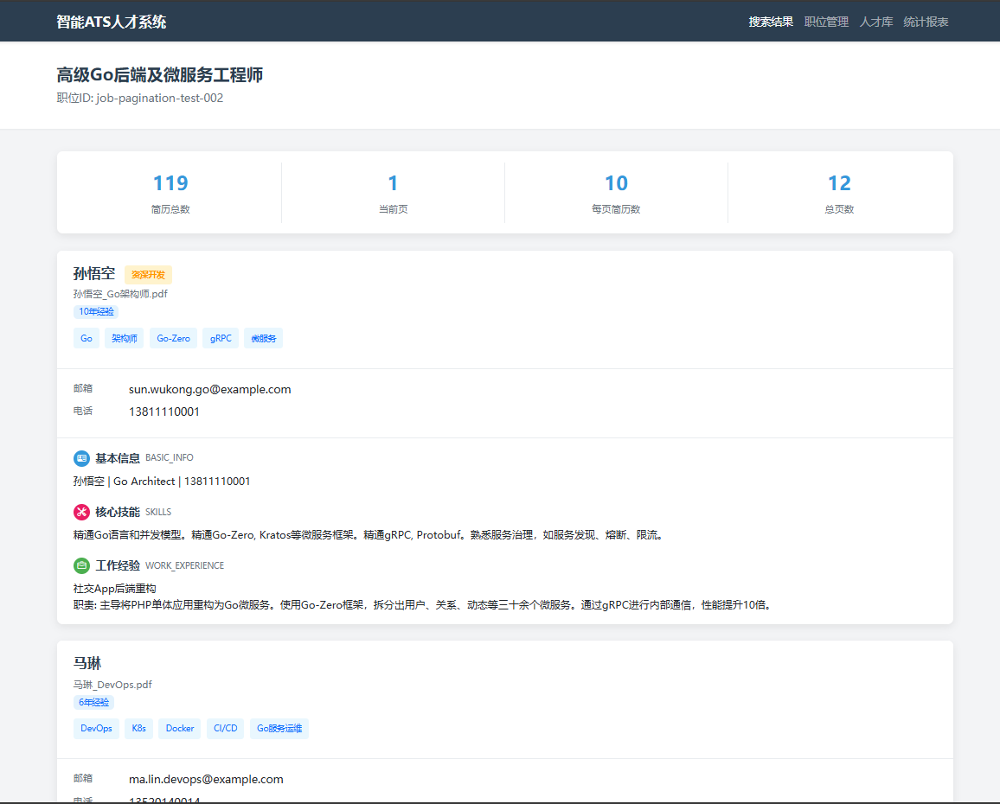

# atsllm-go

atsllm-go 是一个基于Go语言开发的智能简历匹配系统，它利用大型语言模型（LLM）技术实现简历解析、向量化和精准职位匹配。该系统旨在大量简历处理场景下帮助hr减小压力，快速捕获有力竞争者，为企业提高效率，为招聘团队提供高效的人才筛选解决方案。

## 项目demo图


## 主要特性

- **智能简历解析**：支持PDF格式简历上传和LLM自动解析分块和获取基本信息以及解析元信息。
- **向量化检索**：支持hr通过向量数据库作为人才库，快速捞取相关人才，缓解hr在海量简历的大海捞针的场景压力，使用Qdrant向量数据库实现基于语义的相似性搜索。
- **LLM增强分析**：集成阿里云千问大模型，提升简历内容理解
- **分布式架构**：支持高并发请求，通过分布式锁实现资源竞争控制
- **全链路追踪**：集成OpenTelemetry实现分布式追踪，助力问题定位
- **数据一致性**：使用消息队列和事务保证数据处理一致性
- **性能优化**：实现批量处理和异步任务处理机制
- **可视化界面**：提供直观美观的简历展示和搜索界面

## 系统架构



系统主要由以下几个部分组成：

- **API层**：基于Hertz HTTP服务器，处理简历上传、岗位搜索等请求
- **业务逻辑层**：核心处理逻辑，包括简历解析器和岗位处理器
- **存储层**：利用MySQL、Redis、MinIO、RabbitMQ和Qdrant组合存储系统
- **LLM集成**：通过阿里云千问模型实现简历内容理解与结构化
- **监控系统**：基于Grafana、Loki和Tempo实现全链路监控

## 核心流程图解

### 简历上传流程


### 后台处理流程



### 岗位搜索完整流程


### 岗位搜索接口流程


### 候选人检索流程


## 快速开始

### 前置条件

- Go 1.18+
- Docker & Docker Compose
- MinIO
- MySQL 8.0+
- Redis 6.0+
- RabbitMQ
- Qdrant

### 安装步骤

1. 克隆仓库

```bash
git clone https://github.com/yourusername/atsllm-go.git
cd atsllm-go
```

2. 启动依赖服务

```bash
docker-compose up -d
```

3. 配置环境变量

```bash
cp .env.example .env
# 编辑.env文件，设置必要的配置项
```

4. 编译运行

```bash
go build -o atsllm-go ./cmd
./atsllm-go
```

## 配置说明

主要配置位于`internal/config`目录，包含以下几个方面：

- 数据库连接配置
- MinIO对象存储配置
- Redis配置
- RabbitMQ配置
- 阿里云千问API配置
- 服务监控配置

## 核心API接口

| 接口路径 | 方法 | 描述 |
|---------|------|------|
| `/api/v1/resumes/upload` | POST | 上传简历文件 【√】| 
| `/api/v1/jobs/{job_id}/search` | GET | 根据岗位ID搜索匹配简历 【√】| 
| `/api/v1/jobs/{job_id}/resumes/paginated` | GET | 分页获取简历详情 【√】| 
| `/api/v1/jobs/{job_id}/search/status` | GET | 查询搜索状态【todo】 | 
| `/api/v1/jobs/{job_id}/description` | GET | 获取岗位描述 【todo】| 

## 贡献指南

欢迎提交issue和Pull Request：

1. Fork本仓库
2. 创建您的特性分支 (`git checkout -b feature/amazing-feature`)
3. 提交您的更改 (`git commit -m 'Add some amazing feature'`)
4. 推送到分支 (`git push origin feature/amazing-feature`)
5. 打开Pull Request

## 联系方式

- 项目维护者: [周航航](2603167476@qq.com)
- 项目主页: [https://github.com/yourusername/atsllm-go](https://github.com/yourusername/atsllm-go)

---

**atsllm-go** - 让简历筛选更智能，招聘决策更精准